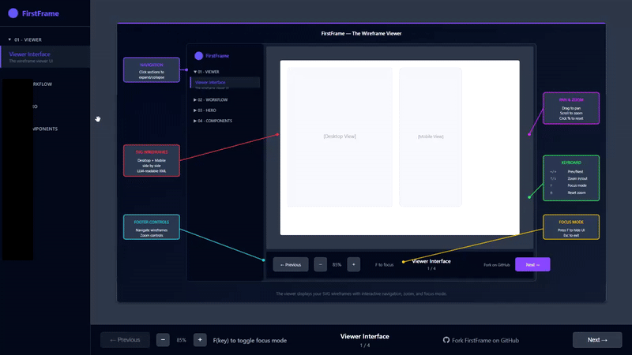

# 🎬 FirstFrame

> Project planning template with SpecKit specifications and interactive wireframe viewer.

**See your project clearly from the first frame.** Plan features with specs and wireframes before writing code.

[](https://tortoisewolfe.github.io/First-Frame/design/wireframes/)

## [👀 View Example Wireframes](https://tortoisewolfe.github.io/First-Frame/design/wireframes/)

Interactive wireframe viewer demonstrating the template structure.

## 🤔 What is FirstFrame?

FirstFrame is a planning-first development template. It helps you:

1. 📜 **Define** your project vision (constitution)
2. 📋 **Specify** features with user stories and acceptance criteria
3. 🖼️ **Visualize** UI with SVG wireframes
4. 🤖 **Feed** all this context to an LLM for implementation

The specs and wireframes you create become excellent context for AI-assisted development.

## 🧩 Why SVG Wireframes?

SVGs are text-based XML. When you create wireframes as SVGs, you're not just making pretty pictures - you're generating structured, semantic context that an LLM can actually understand.

Your AI assistant can read an SVG and know: "This is a 3-column layout. The sidebar has navigation. The main content has a data table. The detail panel shows the selected item."

That's infinitely more useful than describing your UI in prose.

## 📦 What's Included

- 🖥️ Interactive wireframe viewer with pan, zoom, keyboard navigation, and focus mode
- 🎨 Side-by-side Desktop + Mobile wireframe layout (1400×800)
- ⚙️ [GitHub's SpecKit](https://github.com/github/spec-kit) workflow commands built-in
- 🌗 Dark and light theme support for wireframes

## 🚀 Quick Start

### Phase 1: Vision & Design

```bash
# Fork and clone
git clone https://github.com/YOUR-USERNAME/First-Frame.git
cd First-Frame

# Start Claude Code
claude

# Create spec from your feature idea
/speckit.specify

# Refine requirements
/speckit.clarify

# Generate wireframes
/wireframe
```

### ⛔ HARD STOP

**Review wireframes with stakeholders before proceeding.** This is your last chance to validate vision before implementation.

### Phase 2: Implementation

```bash
/speckit.plan        # Design implementation approach
/speckit.checklist   # Generate implementation checklist
/speckit.tasks       # Create task breakdown
/speckit.analyze     # Review spec quality
/speckit.implement   # Execute the plan
```

## 🐳 SpecKit CLI Installation (Optional)

The `/speckit.*` Claude Code commands work without any installation. But if you want [GitHub's SpecKit CLI](https://github.com/github/spec-kit):

<!-- **With Python:**
```bash
pip install uv
uv tool install specify-cli --from git+https://github.com/github/spec-kit.git
specify init --here --ai claude
``` -->

**Without Python (use Docker to install):**
```bash
./specify init --here --ai claude    # Auto-installs via Docker on first run
```

After initialization, SpecKit scripts and templates are local in `.specify/` and run without Docker.

## 🏗️ Structure

```
FirstFrame/
├── docs/
│   ├── constitution-template.md   # Project vision template
│   ├── research/                  # Market & user research
│   └── design/
│       └── wireframes/            # SVG wireframes + viewer
├── specs/
│   └── example-feature.md         # Feature spec template
└── CLAUDE.md                      # AI assistant guidance
```

## ⚡ Moving to Implementation

When you're ready to build, you have options:

**Option A: Fork ScriptHammer**
[ScriptHammer.com](https://scripthammer.com) provides a ready-to-use foundation (Next.js 15, React 19, Supabase, Tailwind). Your FirstFrame specs and wireframes become rich context for implementation.

**Option B: Stay in FirstFrame**
Continue using this repo with SpecKit's full workflow (`/speckit.plan`, `/speckit.tasks`, `/speckit.implement`). Your specs and wireframes guide development right here.

## 🛠️ Commands

### Phase 1: Vision & Design

| Command | Purpose |
|---------|---------|
| `/speckit.specify` | Create structured spec from feature description |
| `/speckit.clarify` | Refine specs with clarifying questions |
| `/wireframe` | Generate dark theme SVG wireframes (1400×800) |
| `/wireframe-light` | Generate light theme SVG wireframes |

**⛔ Review wireframes before proceeding to Phase 2**

### Phase 2: Implementation

| Command | Purpose |
|---------|---------|
| `/speckit.plan` | Design implementation approach |
| `/speckit.checklist` | Generate implementation checklist |
| `/speckit.tasks` | Create actionable task list |
| `/speckit.taskstoissues` | Convert tasks to GitHub issues |
| `/speckit.analyze` | Review spec quality and consistency |
| `/speckit.implement` | Execute implementation plan |

### Wireframe Viewer

| Command | Purpose |
|---------|---------|
| `/hot-reload-viewer` | Start wireframe viewer at localhost:3000 |
| `/svg-to-png` | Convert SVG wireframes to PNG (1200×800) |

### Keyboard Shortcuts

| Key | Action |
|-----|--------|
| **F** | Toggle focus mode (hide sidebar/footer) |
| **Escape** | Exit focus mode |
| **←/→** | Previous/Next wireframe |
| **↑/↓** or **+/-** | Zoom in/out |
| **0** | Reset zoom to 85% |

## 🎬 Why "FirstFrame"?

Every great film starts with a single frame. Before the action, before the drama - there's that first image that sets everything in motion. Building software should work the same way.

**Every movie starts with a storyboard** - rough sketches that visualize scenes before filming begins. Directors don't shoot first and figure out the story later. They plan every shot. Wireframes are your storyboard.

The name is intentional wordplay:

🎯 **"First Frame"** - Like the opening shot of a movie, establish your vision before the story unfolds. Start at the beginning. See the whole picture before you build it.

👓 **"Specs"** - These are your specifications, the detailed requirements that define what you're building. But specs are also glasses - the lenses through which you see your project with crystal clarity.

🖼️ **"Frames"** - The wireframes that hold your vision in place. Just like glasses have frames that support the lenses, your UI wireframes provide the structure that supports your specifications.

✨ **Specs + Frames = clear vision, properly supported.**

---

*Planning template for AI-assisted development*
